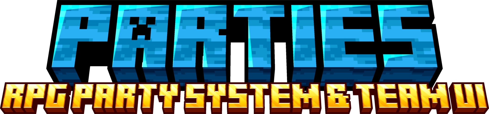
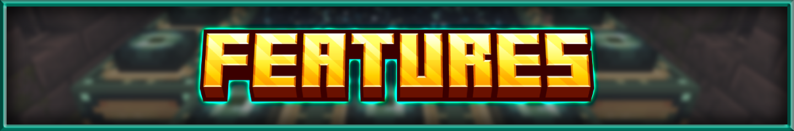
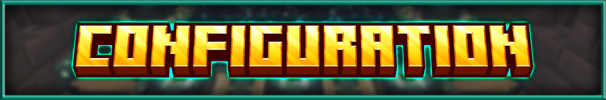
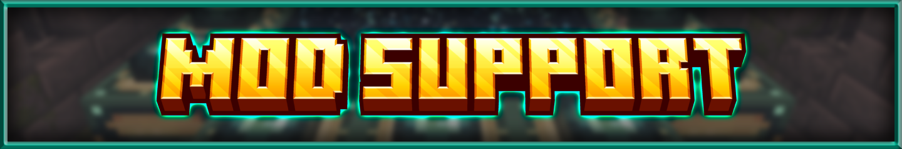
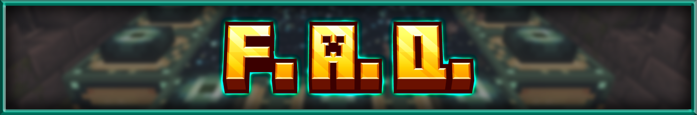

  

---

NOTE: Since v2.0.0, this mod bundles the LyteCore library and Parties: Dynamics.

Parties brings a full party system and customizable HUD to your world, built to make both solo and co-op gameplay a lot more fun.
It tweaks some vanilla mechanics and hooks into other mods so team play actually feels smooth and connected.
Best of all, just about everything can be tweaked to your liking, including building and sharing your own custom UI layouts with friends.
Read on for all the details!

---

  

Parties adds a fully customizable, ever-expanding UI system that allows you to customize how you want your party UI to look like.
Parties: Dynamics is bundled with this mod as well, which adds or enhances social mechanics/interactions for a better experience.

<table style="border: none; border-collapse: collapse; width: 100%;">
  <tr style="border: none;">
    <td style="border: none; vertical-align: top; width: 45%; padding-right: 16px;">
      
    </td>
    <td style="border: none; vertical-align: top; width: 55%;">
      <h3>Extensive HUD Overlay</h3>
      
Renders player & party member health bars, status effects, and more in the form of 'elements'.

      
Every single element can be hovered for tooltip information, and configured to your heart's desire.

      
There are currently 11 different elements with more in the works as more mod support gets added.

    </td>
  </tr>
</table>

<table style="border: none; border-collapse: collapse; width: 100%;" width="100%">
  <tr style="border: none;">
    <td style="border: none; vertical-align: top; width: 55%;" width="55%" valign="top">
      <h3>In-Depth Element Customization</h3>
      

        Each element has a myriad of customization options allowing you to create unique and meaningful designs.
        They can also be disabled if preferring a more minimalist look or emphasis on specific elements.
      

      

        
        The customized layout can be exported as a file or a string of characters to share with others!
      

    </td>
    <td style="border: none; vertical-align: top; width: 45%; padding-left: 16px;" width="45%" valign="top">
      
    </td>
  </tr>
</table>

<table style="border: none; border-collapse: collapse; width: 100%;">
  <tr style="border: none;">
    <td style="border: none; vertical-align: top; width: 45%; padding-right: 16px;">
      
    </td>
    <td style="border: none; vertical-align: top; width: 55%;">
      <h3>Full-Fledged Display Configuration</h3>
      
Modify the look of the player and party frame in the display editor, with support for other types of frames as well.
The layouts previously saved in the layout editor (displayed above) can be attached to a frame in this menu.

      
These layouts persist across launches, allowing you to ship the mod with completely customized layouts for any theme and purpose!

    </td>
  </tr>
</table>

### Extensive Party Mechanics & Features with Parties: Dynamics
Parties: Dynamics is a bundled add-on focused on non-UI party infrastructure mechanics. It currently features:
- **XP Sharing** - Proximity-based (configurable) xp splitting mechanics. Obtained experience is shared evenly across party members, according to configuration.
- **Friendly-fire Protection** - Extended definitions on what a "teammate" is, to prevent unwanted friendly-fire. Now covers pets, summons, and leashed mobs. Also extended protection to cover unwanted potion effect applications and more!
- **[Iron's Spellbooks] Hostile Spell tag** - A new data tag that allows you to define targeted spells from Iron's Spellbooks. If friendly-fire is disabled, these spells will no longer target allies.
- More features to come! See below.
---

  

### Commands

The following commands are available from the mod:

<table>
  <thead>
    <tr>
      <th>Command</th>
      <th>Description</th>
    </tr>
  </thead>
  <tbody>
    <tr>
      <td><code>/parties invite</code></td>
      <td>Sends a party invite to a player. Invites expire after 60 seconds.</td>
    </tr>
    <tr>
      <td><code>/parties accept</code></td>
      <td>Accepts a party invite from a player. If receiving an invitation, you can also click on the respective chat link.</td>
    </tr>
    <tr>
      <td><code>/parties decline</code></td>
      <td>Declines the last party invite from a player. Clicking on the respective chat link also allows you to decline a specific invitation as well.</td>
    </tr>
    <tr>
      <td><code>/parties disband</code></td>
      <td>Disbands the party you're currently in. Can only be done by the party leader.</td>
    </tr>
    <tr>
      <td><code>/parties kick</code></td>
      <td>Removes a player from your current party. If no other players were to remain, it disbands the party instead. Can only be done by the party leader.</td>
    </tr>
    <tr>
      <td><code>/parties leave</code></td>
      <td>Leaves your current party. If leader, it passes leadership to someone else. If party would be left with one player, the party disbands instead.</td>
    </tr>
    <tr>
      <td><code>/parties promote</code></td>
      <td>Transfers leadership to another player. Note that if the leader is offline, leadership may automatically be transferred depending on settings in `parties-common.toml`</td>
    </tr>
    <tr>
      <td><code>/parties help</code></td>
      <td>Provides a little bit of info as to how party works. Will be overhauled soon.</td>
    </tr>
    <tr>
      <td><code>/partiescfg reload</code></td>
      <td>Reloads client side configuration, like from <code>/dimensions/active.json</code></td>
    </tr>
  </tbody>
</table>
Note that the <code>/parties</code> prefix also has the following as options: <code>/p, /party</code>

### Setup
Parties comes bundled with its core library (LyteCore) along with its core addon (Parties: Dynamics), meaning that setup is as simple as downloading the mod and adding it to your game!
All the configuration options are housed within the `minecraft_root/config/parties` directory. A brief description of each file/directory is shown below:

<table>
  <thead>
    <tr>
      <th>Directory/File Name, all within <code>minecraft_root/config/parties/</code></th>
      <th>Description</th>
    </tr>
  </thead>
  <tbody>
    <tr>
      <td><code>parties-common.toml</code></td>
      <td>Contains simple party configuration options, including max party size, automatic leader transfer timers, and an option to use a different party system for the UI (although only supports the Parties mod for now).</td>
    </tr>
    <tr>
      <td><code>parties-client.toml</code></td>
      <td>Contains several client-side rendering options, ranging from radar arrow modifications, UI rendering options, player colorizing, and the HUD Editor button position.</td>
    </tr>
    <tr>
      <td><code>parties_dynamics-common.toml</code></td>
      <td>Contains an option to enable friendlyFire, along with configuring the XP Sharing distance.</td>
    </tr>
    <tr>
      <td><code>lytecore-common.toml</code></td>
      <td>Provides the core Team alliance providers and ownership/damage resolvers. Also dictates the range that "vicinity" means.</td>
    </tr>
    <tr>
      <td><code>/dimensions/active.json</code> &amp; <code>/dimensions/known_cache.json</code></td>
      <td>Contains the active list that the UI pulls dimension data from, along with the known cache dump of dimensions found in the game.</td>
    </tr>
    <tr>
      <td><code>/layouts/</code></td>
      <td>The root directory of custom layout files. These files allow you to create your own unique, sharable party layouts.</td>
    </tr>
    <tr>
      <td><code>active_layouts.json</code></td>
      <td>This file contains the active frame positioning and layout attachment for the current game.</td>
    </tr>
    <tr>
      <td><code>mixins.properties</code></td>
      <td>This file contains options for disabling specific code alterations. The functionality of the Parties mod depends on these changes, so only modify this as a last resort.</td>
    </tr>
    <tr>
      <td><code>modules.properties</code></td>
      <td>This file contains a list of "addon modules" that are used in the Parties mod. This allows you to toggle any specific mod compatibility currently made for the Parties mod.</td>
    </tr>
  </tbody>
</table>

---

  

Parties has a ton of customization options, ranging from an extensive layout editor to complete control on what features you would like enabled.

View the configuration details [here!](https://github.com/JaydenLyte/Parties/wiki/Configuration)

---

  

Older versions of this mod had a different subset of mod compatibility. Starting from 2.0.0, the mod compatibility along with future support is as follows:

<table>
  <thead>
    <tr>
      <th>Mod Name</th>
      <th>Target Version</th>
      <th>Support Description</th>
      <th>✅</th>
    </tr>
  </thead>
  <tbody>
    <tr>
      <td><code>Iron's Spells n' Spellbooks</code></td>
      <td>~v1.20.1-3.4.0.9+</td>
      <td>
A Cast Bar element, a Mana Bar element, summon, spells, and projectile spell integration for friendly fire prevention.

      
Note: If playing earlier versions of Iron's Spells, you should change <code>resolveIronsSummons</code> to <code>false</code> inside <code>minecraft_root/config/parties/lytecore-common.toml</code>, even if the mod prevents a crash anyway.

      </td>
      <td>🟢</td>
    </tr>
    <tr>
      <td><code>Ars Nouveau</code></td>
      <td>-</td>
      <td>A Mana Bar element, considering Cast Bar integration for spells that meet the requirements.</td>
      <td>🟡</td>
    </tr>
    <tr>
      <td><code>Simple Voice Chat</code></td>
      <td>-</td>
      <td>Voice Chat Element/border, party synchronization, and automatic group creations.</td>
      <td>⚪</td>
    </tr>
    <tr>
      <td><code>Epic Fight</code></td>
      <td>-</td>
      <td>A Stamina bar element, considering Cast Bar integration for Epic Fight skills.</td>
      <td>⚪</td>
    </tr>
  </tbody>
</table>

---

  

### Can I use this mod in a modpack or playthrough?
> **Of course!** You are completely free to include this mod in any public or private modpack, server, video, or stream.

---

### How do I disable or edit the UI?
> Full instructions are listed in the **Configuration** section above.
>
> There are two distinct configuration modes:
> - **Layout:** Controls visual positioning, anchors, and scaling.
> - **HUD:** Controls visibility, toggles, and element behaviors.
>
> *Keybinds for both menus can be customized directly in your Minecraft **Options → Controls** menu.*

---

### This mod is conflicting with another mod or causing a crash!
> Please file a report on the **Issue Tracker** with your crash log (`crash-reports` or `latest.log`).
>
> Because this mod focuses heavily on custom rendering and data handling, cross-mod quirks are usually straightforward to patch once a log and reproduction steps are provided.

---

### Can you add support for another mod?
> Submit a request on the **Issue Tracker** with details about the mod and how you'd like them to integrate, and it will be taken into consideration!

---

### Is there a Fabric version available?
> **Not right now.** The focus remains on Forge and NeoForge, but definitely in the future!

---

### Can you backport changes or support older Minecraft versions?
> **No backports, yet.** Development priorities are focused on modern support and moving forward to the latest Minecraft releases first.

---
Questions? Send me a message! I am reachable on CurseForge :)
