

  

---

NOTE: Since v2.0.0, this mod bundles the LyteCore library and Parties: Dynamics. 

The Parties mod introduces a party system built to integrate smoothly with other mods for a unified solo or multiplayer 
RPG experience. It updates vanilla and modded mechanics to improve group dynamics, includes a highly customizable Team 
UI, and is built with a minimal footprint to keep your game smooth. Nearly everything added can be tweaked or turned 
off completely, all detailed below.

---

  

Parties adds a fully customizable, ever-expanding UI system that allows you to customize how you want your party UI to look like.
Parties: Dynamics is bundled with this mod as well, which adds or enhances social mechanics/interactions for a better experience.

<table style="border: none; border-collapse: collapse; width: 100%;">
  <tr style="border: none;">
    <td style="border: none; vertical-align: top; width: 45%; padding-right: 16px;">
      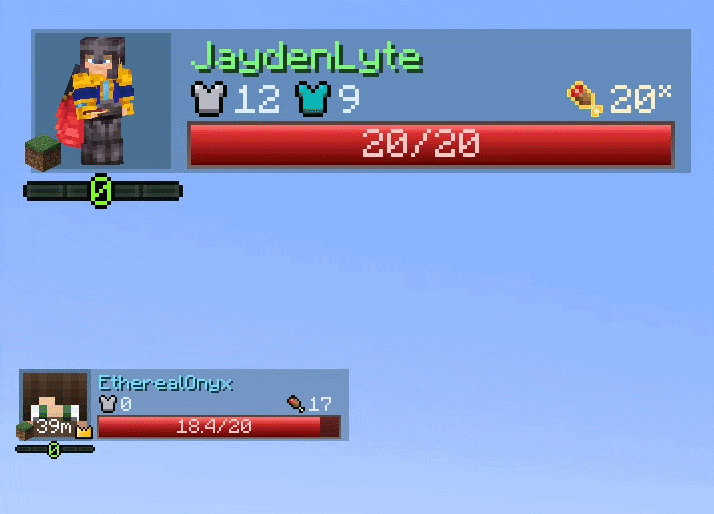
    </td>
    <td style="border: none; vertical-align: top; width: 55%;">
      <h3>Extensive HUD Overlay</h3>
      
Renders player & party member health bars, status effects, and more in the form of 'elements'.

      
Every single element can be hovered for tooltip information, and configured to your heart's desire.

      
There are currently 11 different elements with more in the works as more mod support gets added.

    </td>
  </tr>
</table>

<table style="border: none; border-collapse: collapse; width: 100%;" width="100%">
  <tr style="border: none;">
    <td style="border: none; vertical-align: top; width: 55%;" width="55%" valign="top">
      <h3>In-Depth Element Customization</h3>
      

        Each element has a myriad of customization options allowing you to create unique and meaningful designs.
        They can also be disabled if preferring a more minimalist look or emphasis on specific elements.
      

      

        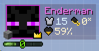
        The customized layout can be exported as a file or a string of characters to share with others!
      

    </td>
    <td style="border: none; vertical-align: top; width: 45%; padding-left: 16px;" width="45%" valign="top">
      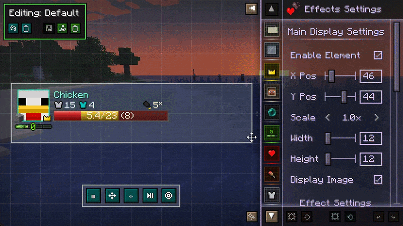
    </td>
  </tr>
</table>

<table style="border: none; border-collapse: collapse; width: 100%;">
  <tr style="border: none;">
    <td style="border: none; vertical-align: top; width: 45%; padding-right: 16px;">
      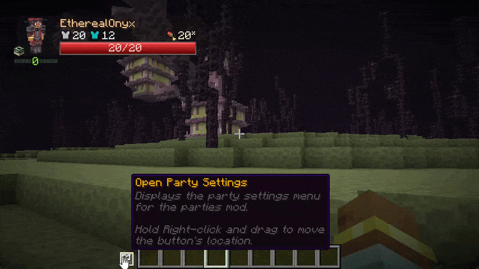
    </td>
    <td style="border: none; vertical-align: top; width: 55%;">
      <h3>Full-Fledged Display Configuration</h3>
      
Modify the look of the player and party frame in the display editor, with support for other types of frames as well.
The layouts previously saved in the layout editor (displayed above) can be attached to a frame in this menu.

      
These layouts persist across launches, allowing you to ship the mod with completely customized layouts for any theme and purpose!

    </td>
  </tr>
</table>

### Extensive Party Mechanics & Features with Parties: Dynamics
Parties: Dynamics is a bundled add-on focused on non-UI party infrastructure mechanics. It currently features:
- **XP Sharing** - Proximity-based (configurable) xp splitting mechanics. Obtained experience is shared evenly across party members, according to configuration.
- **Friendly-fire Protection** - Extended definitions on what a "teammate" is, to prevent unwanted friendly-fire. Now covers pets, summons, and leashed mobs. Also extended protection to cover unwanted potion effect applications and more!
- **[Iron's Spellbooks] Hostile Spell tag** - A new data tag that allows you to define targeted spells from Iron's Spellbooks. If friendly-fire is disabled, these spells will no longer target allies.
- More features to come! See below.
---

  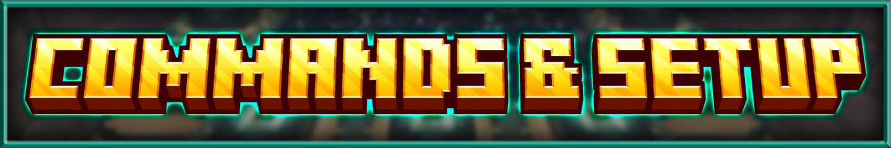

### Commands

The following commands are available from the mod:

<table>
  <thead>
    <tr>
      <th>Command</th>
      <th>Description</th>
    </tr>
  </thead>
  <tbody>
    <tr>
      <td><code>/parties invite</code></td>
      <td></td>
    </tr>
    <tr>
      <td><code>/parties accept</code></td>
      <td>Accepts a party invite from a player. If receiving an invitation, you can also click on the respective chat link.</td>
    </tr>
    <tr>
      <td><code>/parties decline</code></td>
      <td>Declines the last party invite from a player. Clicking on the respective chat link also allows you to decline a specific invitation as well.</td>
    </tr>
    <tr>
      <td><code>/parties disband</code></td>
      <td>Disbands the party you're currently in. Can only be done by the party leader.</td>
    </tr>
    <tr>
      <td><code>/parties kick</code></td>
      <td>Removes a player from your current party. If no other players were to remain, it disbands the party instead. Can only be done by the party leader.</td>
    </tr>
    <tr>
      <td><code>/parties leave</code></td>
      <td>Leaves your current party. If leader, it passes leadership to someone else. If party would be left with one player, the party disbands instead.</td>
    </tr>
    <tr>
      <td><code>/parties promote</code></td>
      <td>Transfers leadership to another player. Note that if the leader is offline, leadership may automatically be transferred depending on settings in `parties-common.toml`</td>
    </tr>
    <tr>
      <td><code>/parties help</code></td>
      <td>Provides a little bit of info as to how party works. Will be overhauled soon.</td>
    </tr>
    <tr>
      <td><code>/partiescfg reload</code></td>
      <td>Reloads client side configuration, like from <code>/dimensions/active.json</code></td>
    </tr>
  </tbody>
</table>
Note that the <code>/parties</code> prefix also has the following as options: <code>/p, /party</code>

### Setup
Parties comes bundled with its core library (LyteCore) along with its core addon (Parties: Dynamics), meaning that setup is as simple as downloading the mod and adding it to your game!
All the configuration options are housed within the `minecraft_root/config/parties` directory. A brief description of each file/directory is shown below:

<table>
  <thead>
    <tr>
      <th>Directory/File Name, all within <code>minecraft_root/config/parties/</code></th>
      <th>Description</th>
    </tr>
  </thead>
  <tbody>
    <tr>
      <td><code>parties-common.toml</code></td>
      <td>Contains simple party configuration options, including max party size, automatic leader transfer timers, and an option to use a different party system for the UI (although only supports the Parties mod for now).</td>
    </tr>
    <tr>
      <td><code>parties-client.toml</code></td>
      <td>Contains several client-side rendering options, ranging from radar arrow modifications, UI rendering options, player colorizing, and the HUD Editor button position.</td>
    </tr>
    <tr>
      <td><code>parties_dynamics-common.toml</code></td>
      <td>Contains an option to enable friendlyFire, along with configuring the XP Sharing distance.</td>
    </tr>
    <tr>
      <td><code>lytecore-common.toml</code></td>
      <td>Provides the core Team alliance providers and ownership/damage resolvers. Also dictates the range that "vicinity" means.</td>
    </tr>
    <tr>
      <td><code>/dimensions/active.json</code> &amp; <code>/dimensions/known_cache.json</code></td>
      <td>Contains the active list that the UI pulls dimension data from, along with the known cache dump of dimensions found in the game.</td>
    </tr>
    <tr>
      <td><code>/layouts/</code></td>
      <td>The root directory of custom layout files. These files allow you to create your own unique, sharable party layouts.</td>
    </tr>
    <tr>
      <td><code>active_layouts.json</code></td>
      <td>This file contains the active frame positioning and layout attachment for the current game.</td>
    </tr>
    <tr>
      <td><code>mixins.properties</code></td>
      <td>This file contains options for disabling specific code alterations. The functionality of the Parties mod depends on these changes, so only modify this as a last resort.</td>
    </tr>
    <tr>
      <td><code>modules.properties</code></td>
      <td>This file contains a list of "addon modules" that are used in the Parties mod. This allows you to toggle any specific mod compatibility currently made for the Parties mod.</td>
    </tr>
  </tbody>
</table>

---

  

Parties has a ton of customization options, ranging from an extensive layout editor to complete control on what features you would like enabled.

<table style="border: none; border-collapse: collapse; width: 100%;">
  <tr style="border: none;">
    <td style="border: none; vertical-align: top; width: 70%; padding-right: 16px;">
      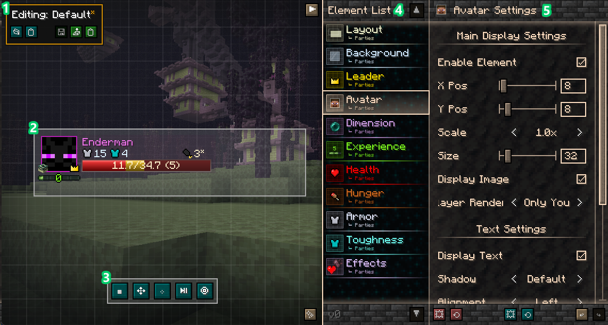
    </td>
    <td style="border: none; vertical-align: top; width: 55%;">
      <h3>Layout Editor</h3>
      
The Layout Editor is the place where you're able to customize the party UI to your liking. Each layout can be saved to a file, exported as a string for sharing, and applied to different frames in the HUD editor.

      
You can open the layout editor directly through an optional keybind, or through the HUD screen that brings up the mouse (default <code>Left Alt</code>).

      
The left image shows the Layout Editor, with areas of interest numbered from 1 through 9. They are explained below.

    </td>
  </tr>
</table>

### Layout Editor Components

<table width="100%">
  <tbody>
    <!-- Row 1 -->
    <tr>
      <td align="center" valign="middle" width="10%"><h2>1</h2></td>
      <td align="center" valign="middle" width="30%">
        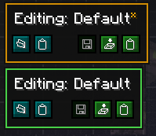
      </td>
      <td align="left" valign="middle" width="60%">
        <h3>Editor File Menu</h3>
        
This menu allows you to load or save your current edited preset to a new file, or to the clipboard. From left to right, each button does the following:

        <ul>
          <li><strong>Load From File:</strong> Loads a previously saved layout from your local directory into the editor. The directory is located in <code>minecraft_root/config/parties/layouts/</code>.</li>
          <li><strong>Import from Clipboard:</strong> Attempts to create a layout from your system's clipboard, allows you to save it, and then loads it into the active workspace.</li>
          <li><strong>Save (Overwrite):</strong> Saves the layout back to the active file, replacing the old data.</li>
          <li><strong>Save to File:</strong> Saves the layout to a completely new file on your drive in the same directory shown above.</li>
          <li><strong>Export to Clipboard:</strong> Compiles the current layout into a data string and copies it to your clipboard for rapid sharing.</li>
        </ul>
        
The menu can also be clicked on to minimize the buttons and reduce footprint, as shown below:

        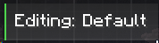
      </td>
    </tr>
    <!-- Row 2 -->
    <tr>
      <td align="center" valign="middle" width="10%"><h2>2</h2></td>
      <td align="center" valign="middle" width="30%">
        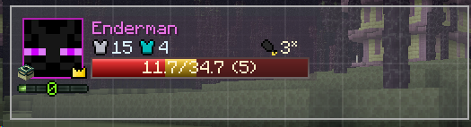
      </td>
      <td align="left" valign="middle" width="60%">
        <h3>Party UI Display</h3>
        
This UI display shows how the entire UI configuration would look like when applied to a frame.

        
The entire view area the display resides in can be dragged to move the UI display around. Scrolling the wheel also changes the scale, although this type of scale change is only for viewing purposes.

        
Selecting the Frame Layout in the element list displays two preview copies to help fine-tune padding and alignment for group layouts like the Party Frame.

      </td>
    </tr>
    <!-- Row 3 -->
    <tr>
      <td align="center" valign="middle" width="10%"><h2>3</h2></td>
      <td align="center" valign="middle" width="30%">
        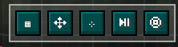
      </td>
      <td align="left" valign="middle" width="60%">
       <h3>Stage View Settings</h3>
        
These buttons don't apply changes to the layout, but rather allow you to change how the staging view displays the layout.

         
From left to right, each button does the following:

        <ul>
          <li><strong>Toggle Grid:</strong> Toggles the visibility of the grid layout markers. The grid is 8x8 pixels while the thicker grid is 32x32 pixels.</li>
          <li><strong>Lock Stage View:</strong> Toggles the ability to drag the UI Display around, in case you want to prevent accidental movement.</li>
          <li><strong>Center Stage View:</strong> Re-centers and scales the UI preset to fit the provided Stage View space.</li>
          <li><strong>Toggle Animations:</strong> Toggles UI animations. When selecting an element from the Element List, animations play for that specific element (or all, depending on the button below). This allows you to see how the animations look like in action.</li>
          <li><strong>Toggle Single Animations:</strong> Toggles single UI animations - determines whether to only play the animations for the selected element or for everything.</li>
        </ul>
      </td>
    </tr>
    <!-- Row 4 -->
    <tr>
      <td align="center" valign="middle" width="10%"><h2>4</h2></td>
      <td align="center" valign="middle" width="30%">
        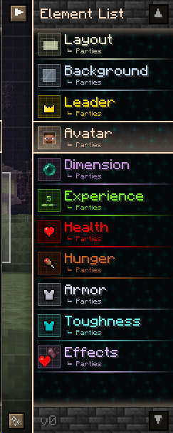
      </td>
     <td align="left" valign="middle" width="60%">
  <h3>Element List</h3>
  
The element list allows you to select what specific element of the party UI to modify. It also includes the Layout Settings of the frame.

   
From top to bottom, the displayed elements are as follows:

  <ul>
    <li><strong>Layout:</strong> The layout element controls the padding and size of the entire layout, per entity.</li>
    <li><strong>Background:</strong> The background element allows you to adjust the transparent glass-like backdrop of the UI.</li>
    <li><strong>Leader:</strong> The leader element allows you to modify the leader icon that appears for a party leader.</li>
    <li><strong>Avatar:</strong> The avatar element controls the head (or paper doll) and the name of the entity in the UI. It allows you to adjust the head into several modes, including a compass, simple head, and a paper doll.</li>
    <li><strong>Dimension:</strong> The dimension element controls the dimension icon as well as the animation that plays when you change dimensions.</li>
    <li><strong>Experience:</strong> The experience element allows you to adjust how the vanilla-styled experience bar is displayed.</li>
    <li><strong>Health:</strong> The health element, an "overflowing bar" type element, allows you to adjust the display of the health along with absorption. You can also toggle between a bar, a flat bar, a single icon, or an icon array (like vanilla's Health display).</li>
    <li><strong>Hunger:</strong> The hunger element, also the same type as health, has similar options to choose from but defaults to a simple icon display.</li>
    <li><strong>Armor:</strong> The armor element allows you to modify the armor display in the UI. Note that hovering over the icon also shows the toughness level.</li>
    <li><strong>Toughness:</strong> The toughness element allows you to modify the toughness display in a similar manner to Armor, except that hides itself when it is zero.</li>
    <li><strong>Effects:</strong> The effects element allows you to configure a ton of different style options for how mob effects are rendered on players.</li>
  </ul>
   
More elements are definitely coming in the future, with some already implemented! Details below.

   
The Element list also has a couple of buttons and displays with some functionality/information, detailed below

  <ul>
    <li><strong>Element List Expand Button (top-left):</strong> It expands and contracts the element list to show names or just icons.</li>
    <li><strong>Element Configuration Texture Toggle (bottom-left):</strong> Toggles the display of textures on the interface, with it reverting to a transparent look if disabled.</li>
    <li><strong>Move List Up/Down Buttons (top-right/bottom-right):</strong> When the element list overflows, these buttons allow you to go up and down the list. You are also able to use mouse scrolling (or the scrollbar that appears).</li>
    <li><strong>Version number (bottom-left):</strong> Shows the current version number of the layout editor. Different version numbers have different compatibilities with each other.</li> 
</ul>
</td>
    </tr>
    <!-- Row 5 -->
    <tr>
      <td align="center" valign="middle" width="10%"><h2>5</h2></td>
      <td align="center" valign="middle" width="30%">
        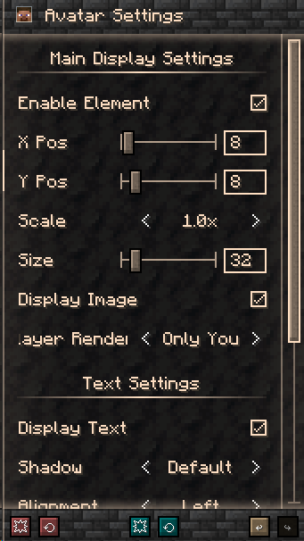
      </td>
      <td align="left" valign="middle" width="60%">
        <h3>Element Settings</h3>
        
This panel allows you to configure different settings for the selected element. If the number of options exceeds the physical space, a scroll bar appears allowing you to drag it or use the mouse wheel.

        
The footer consists of a series of three buttons that allow you to reset the layout to default values, revert the layout to last saved state, and undo/redo changes. From left to right, the buttons are as follows:

         <ul>
<li><strong>Reset All:</strong> Resets all elements to the default values.</li>
    <li><strong>Reset Selected:</strong> Resets the selected element to its default values.</li>
    <li><strong>Revert All:</strong> Reverts all elements to the last saved state.</li>
    <li><strong>Revert Selected:</strong> Reverts the selected element to the last saved state.</li>
    <li><strong>Undo:</strong> Undoes the last modified value. The tooltip indicates what it will change.</li>
    <li><strong>Redo:</strong> Redoes the previously undone item. The tooltip indicates what it will change.</li> 
</ul>      
</td>
    </tr>
  </tbody>
</table>

---
<table style="border: none; border-collapse: collapse; width: 100%;">
  <tr style="border: none;">
    <td style="border: none; vertical-align: top; width: 70%; padding-right: 16px;">
      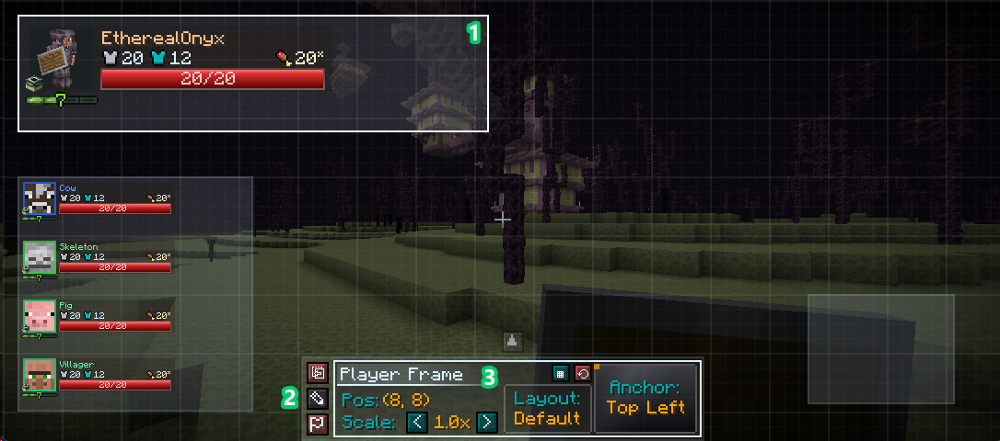
    </td>
    <td style="border: none; vertical-align: top; width: 55%;">
      <h3>HUD Editor</h3>
      
You can access the HUD editor with the default keybind <code>Left Alt</code>, which brings up a singular brown button with a flag, that then opens up this editor with the menu as shown in component #2 below.

The brown button can be dragged with right click across the screen for better accessibility in case it's covering a UI component.

The left image shows areas of interest labeled 1 to 3, where each is explained below.

    </td>
  </tr>
</table>

### HUD Editor Components

<table width="100%">
  <tbody>
    <!-- Row 1 -->
    <tr>
      <td align="center" valign="middle" width="10%"><h2>1</h2></td>
      <td align="center" valign="middle" width="30%">
        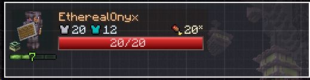
      </td>
      <td align="left" valign="middle" width="60%">
        <h3>UI Frames</h3>
        
These are the frames that can be configured in many ways including position, scale, chosen layout, or anchoring. Details are shown below.

You can select a frame by clicking on them, denoted by its white outline.

      </td>
    </tr>
    <!-- Row 2 -->
    <tr>
      <td align="center" valign="middle" width="10%"><h2>2</h2></td>
      <td align="center" valign="middle" width="30%">
        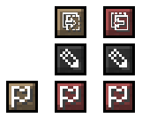
      </td>
      <td align="left" valign="middle" width="60%">
        <h3>Hud Editor Menu</h3>
        
The menu consists of three different buttons represented in different states. When opening the screen, only the left button is present until interacted with. The buttons from top to bottom are as follows:

        <ul>
    <li><strong>Open HUD Editor:</strong> Opens the HUD Editor for layout configuration. Turns red when the button changes to close the editor. </li>
    <li><strong>Open Layout Editor:</strong> Opens the layout editor without directly opening any file for editing, allowing you to use a fresh slate. The layout editor's session persists while the game is running to allow the ability to close the screen when in danger.</li>
        <li><strong>Open Menu:</strong> Opens the rest of the menu to unlock different options. Turns red when the button changes to close menu. This button can be dragged while holding right click to change the location of the persistent button whenever the base HUD Editor is opened (default <code>Left Alt</code>).</li>
</ul>
      </td>
    </tr>
    <!-- Row 3 -->
    <tr>
      <td align="center" valign="middle" width="10%"><h2>3</h2></td>
      <td align="center" valign="middle" width="30%">
        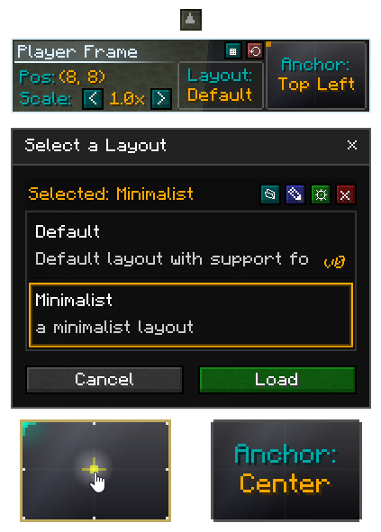
      </td>
      <td align="left" valign="middle" width="60%">
        <h3>HUD Frame Configuration Menu</h3>
        
After pressing the HUD Editor button (explained above), this menu appears next to the buttons. This menu allows you to change the position, scale, layout, and anchor location of frames that support these options. The actual configuration values are in orange.

        
There is also a button right above the menu that allows you to swap the position of the entire menu to the top of the screen, in case you want to align something near the bottom. There are also two more buttons above the layout selector, explained below, from left to right:

        <ul>
 <li><strong>Toggle Grid:</strong> Toggles the visibility of the grid layout markers. The grid is 8x8 pixels while the thicker grid is 32x32 pixels. </li>
    <li><strong>Reset Layout:</strong> Resets the currently selected frame's position, scale, and anchors to default values.</li>
        </ul>
        
When clicking on the Layout selector, a new window pops up allowing you to Select a Layout for the current frame. Next to the selected layout indicator, the buttons, from left to right, are as follows:

              <ul>
 <li><strong>Open Layout Directory</strong> Opens the layout directory on your computer. The directory is at <code>minecraft_root/config/parties/layouts/</code>.</li>
<li><strong>Rename Layout:</strong> Allows you to rename the currently selected layout, provided that a selected one isn't a default layout.</li>
 <li><strong>Open Editor:</strong> Opens the Layout Editor with the currently selected layout, allowing you to fine tweak things or create a new layout from it.</li>
    <li><strong>Delete Layout:</strong> Deletes the currently selected layout. Note that after the warning screen, there is no going back after deletion</li>
</ul>

The anchor selector resides right next to the layout selector, and allows you to select a different anchor point to build offsets from. When hovering the selector, nine different anchor points are available to choose from. These are useful for configuration layouts that support different screen sizes.

</td>
    </tr>
  </tbody>
</table>

### Compatibility Module Configuration
Parties is a mod that integrates with other mods at its core, so these integrations will always be expanded upon. Since you can't guarantee that an integration that works today will work tomorrow, all of these integrations have been made modular. The following integrations are found in `minecraft_root/config/parties/modules.properties` and are as follows:

<table width="100%" style="border-collapse: collapse; text-align: left;">
  <thead>
    <tr style="background-color: #2a2a2a;">
      <th style="padding: 10px;" width="40%">Module Id</th>
      <th style="padding: 10px;" width="60%">Description</th>
    </tr>
  </thead>
  <tbody>
    <tr>
      <td style="padding: 10px; border-bottom: 1px solid #444;"><code>irons_spellbooks.element_castbar</code></td>
      <td style="padding: 10px; border-bottom: 1px solid #444;">Enables the Cast Bar element for Iron's Spells n Spellbooks. It is visible when casting any spell with or without a duration, for all members.</td>
    </tr>
    <tr>
      <td style="padding: 10px; border-bottom: 1px solid #444;"><code>irons_spellbooks.element_manabar_is</code></td>
      <td style="padding: 10px; border-bottom: 1px solid #444;">Enables the Mana Bar element for Iron's Spells n Spellbooks. It syncs and displays your mana and max mana across the party.</td>
    </tr>
    <tr>
      <td style="padding: 10px; border-bottom: 1px solid #444;"><code>irons_spellbooks.hostile_spell_registry</code></td>
      <td style="padding: 10px; border-bottom: 1px solid #444;">Adds a new tag for spells of Iron's Spells n Spellbooks. If the spell is targeted (can lock onto someone), adding this tag allows for filtering team members, preventing friendly fire or wasted targeting.</td>
    </tr>
    <tr>
      <td style="padding: 10px; border-bottom: 1px solid #444;"><code>irons_spellbooks.resolver_summons</code></td>
      <td style="padding: 10px; border-bottom: 1px solid #444;">Adds Iron's Spells n Spellbooks summon entities as an owner resolving type for team member filtering. It allows for friendly-fire protection of your summons.</td>
    </tr>
  </tbody>
</table>

### Mixin Module Configuration
As mentioned above, integrations between mods could be quite fragile. Therefore, almost every coded change can also be configured in this file, found at `minecraft_root/config/parties/mixins.properties`. Most of these are necessary to achieve full functionality of the mod, where disabling them might break things. However, the option is available as a workaround for compatibility with other mods, as a last resort. The settings are as follows: 

<table width="100%" style="border-collapse: collapse; text-align: left;">
  <thead>
    <tr style="background-color: #2a2a2a;">
      <th style="padding: 10px;" width="30%">Module Id</th>
      <th style="padding: 10px;" width="40%">Description</th>
      <th style="padding: 10px;" width="30%">Changes if Disabled</th>
    </tr>
  </thead>
  <tbody>
    <tr>
      <td style="padding: 10px; border-bottom: 1px solid #444;"><code>accessor.minecraft.chunk_map.entity_tracker</code></td>
      <td style="padding: 10px; border-bottom: 1px solid #444;">Provides EntityMap/seenBy() access for party proximity checks regarding stat tracking.</td>
      <td style="padding: 10px; border-bottom: 1px solid #444;">Defaults to marking players as distant, server-side tracking.</td>
    </tr>
    <tr>
      <td style="padding: 10px; border-bottom: 1px solid #444;"><code>mixin.minecraft.living_entity_health_effects</code></td>
      <td style="padding: 10px; border-bottom: 1px solid #444;">Provides LivingEntity access for party health updates.</td>
      <td style="padding: 10px; border-bottom: 1px solid #444;">Breaks any health updates and tracking for the Party UI.</td>
    </tr>
    <tr>
      <td style="padding: 10px; border-bottom: 1px solid #444;"><code>mixin.ironsspellbooks.entity.spell_ownership</code></td>
      <td style="padding: 10px; border-bottom: 1px solid #444;">Keeps track of spell ownership for the given spell entity to figure out alliance mechanics.</td>
      <td style="padding: 10px; border-bottom: 1px solid #444;">Spells with no traceable owner will affect allies.</td>
    </tr>
    <tr>
      <td style="padding: 10px; border-bottom: 1px solid #444;"><code>mixin.ironsspellbooks.entity.allied_mechanics</code></td>
      <td style="padding: 10px; border-bottom: 1px solid #444;">Intercepts targeted spells utilizing a hostile spell filter, passing it through an Alliance check.</td>
      <td style="padding: 10px; border-bottom: 1px solid #444;">Targeted hostile spells could still be cast on allies.</td>
    </tr>
    <tr>
      <td style="padding: 10px; border-bottom: 1px solid #444;"><code>mixin.minecraft.online_state</code></td>
      <td style="padding: 10px; border-bottom: 1px solid #444;">Provides Online tracking hooks for the Party UI</td>
      <td style="padding: 10px; border-bottom: 1px solid #444;">Breaks online-tracking UI updates for the Party UI.</td>
    </tr>
    <tr>
      <td style="padding: 10px; border-bottom: 1px solid #444;"><code>mixin.minecraft.client_packet_listener</code></td>
      <td style="padding: 10px; border-bottom: 1px solid #444;">Intercepts incoming packets to synchronize health, attributes, and mob effects.</td>
      <td style="padding: 10px; border-bottom: 1px solid #444;">Breaks synchronization of health, stats, and mob effects in the Party UI.</td>
    </tr>
    <tr>
      <td style="padding: 10px; border-bottom: 1px solid #444;"><code>mixin.minecraft.entity.allied_mechanics</code></td>
      <td style="padding: 10px; border-bottom: 1px solid #444;">Intercepts alliance (isAlliedTo) mechanics for anything using the Team Alliance API.</td>
      <td style="padding: 10px; border-bottom: 1px solid #444;">Uses standard team alliance checks, unless modified externally.</td>
    </tr>
    <tr>
      <td style="padding: 10px; border-bottom: 1px solid #444;"><code>mixin.minecraft.render_type</code></td>
      <td style="padding: 10px; border-bottom: 1px solid #444;">Overrides armor and entity render materials to enforce translucency.</td>
      <td style="padding: 10px; border-bottom: 1px solid #444;">Causes ghost party members to render fully opaque instead of with the intended translucency.</td>
    </tr>
    <tr>
      <td style="padding: 10px; border-bottom: 1px solid #444;"><code>mixin.minecraft.attribute_map</code></td>
      <td style="padding: 10px; border-bottom: 1px solid #444;">Provides AttributeMap access for party attribute syncing.</td>
      <td style="padding: 10px; border-bottom: 1px solid #444;">Breaks any attribute-related UI update for the Party UI.</td>
    </tr>
    <tr>
      <td style="padding: 10px; border-bottom: 1px solid #444;"><code>accessor.minecraft.item_entity.age</code></td>
      <td style="padding: 10px; border-bottom: 1px solid #444;">Allows access to ItemEntity's age value for loot despawn overrides.</td>
      <td style="padding: 10px; border-bottom: 1px solid #444;">Only overrides ItemEntity age when set to infinite.</td>
    </tr>
    <tr>
      <td style="padding: 10px; border-bottom: 1px solid #444;"><code>mixin.minecraft.player.player_color</code></td>
      <td style="padding: 10px; border-bottom: 1px solid #444;">Tracks player ownership colors for UI, names, and loot via LocatorBar-style assignment.</td>
      <td style="padding: 10px; border-bottom: 1px solid #444;">Everyone's color is white.</td>
    </tr>
    <tr>
      <td style="padding: 10px; border-bottom: 1px solid #444;"><code>mixin.minecraft.food_data</code></td>
      <td style="padding: 10px; border-bottom: 1px solid #444;">Provides FoodData access for party saturation/hunger updates.</td>
      <td style="padding: 10px; border-bottom: 1px solid #444;">Breaks any food-related UI updates for the Party UI.</td>
    </tr>
    <tr>
      <td style="padding: 10px; border-bottom: 1px solid #444;"><code>mixin.minecraft.chat_screen</code></td>
      <td style="padding: 10px; border-bottom: 1px solid #444;">Adds tooltip integration on the Party UI while the chat screen is open</td>
      <td style="padding: 10px; border-bottom: 1px solid #444;">Tooltips no longer render in the Chat Screen for the party ui.</td>
    </tr>
    <tr>
      <td style="padding: 10px; border-bottom: 1px solid #444;"><code>mixin.minecraft.living_entity.text_render</code></td>
      <td style="padding: 10px; border-bottom: 1px solid #444;">Disables extra text rendering on entities when rendering the player in the Party UI.</td>
      <td style="padding: 10px; border-bottom: 1px solid #444;">Allows flat text to render on the player in the party UI, which is only visible at certain angles.</td>
    </tr>
    <tr>
      <td style="padding: 10px; border-bottom: 1px solid #444;"><code>mixin.minecraft.synched_entity_data</code></td>
      <td style="padding: 10px; border-bottom: 1px solid #444;">Enables client-side synchronization for health and absorption across party members nearby.</td>
      <td style="padding: 10px; border-bottom: 1px solid #444;">Forces separate, server-sided information packets</td>
    </tr>
    <tr>
      <td style="padding: 10px; border-bottom: 1px solid #444;"><code>mixin.minecraft.living_entity.renderer</code></td>
      <td style="padding: 10px; border-bottom: 1px solid #444;">Intercepts character rendering and geometry for the Party UI and transparent models.</td>
      <td style="padding: 10px; border-bottom: 1px solid #444;">Breaks 3D character rendering and ghost overlays in the Party UI.</td>
    </tr>
    <tr>
      <td style="padding: 10px; border-bottom: 1px solid #444;"><code>mixin.minecraft.local_player.xp</code></td>
      <td style="padding: 10px; border-bottom: 1px solid #444;">Intercepts local player experience updates to sync with the party data handler.</td>
      <td style="padding: 10px; border-bottom: 1px solid #444;">Prevents the local player's XP bar from syncing and updating within the Party UI.</td>
    </tr>
    <tr>
      <td style="padding: 10px; border-bottom: 1px solid #444;"><code>mixin.minecraft.social.player_entry</code></td>
      <td style="padding: 10px; border-bottom: 1px solid #444;">Injects a custom party invite button into the vanilla Social Interactions screen.</td>
      <td style="padding: 10px; border-bottom: 1px solid #444;">Removes the ability to invite players to a party directly from the social menu.</td>
    </tr>
    <tr>
      <td style="padding: 10px; border-bottom: 1px solid #444;"><code>mixin.minecraft.player.sync</code></td>
      <td style="padding: 10px; border-bottom: 1px solid #444;">Links player instances to food/attribute data and sends out experience and absorption updates for server-sided party syncing.</td>
      <td style="padding: 10px; border-bottom: 1px solid #444;">Stops the server from tracking and broadcasting experience, food, and absorption changes to the party.</td>
    </tr>
    <tr>
      <td style="padding: 10px; border-bottom: 1px solid #444;"><code>mixin.minecraft.living_entity.effects_check</code></td>
      <td style="padding: 10px; border-bottom: 1px solid #444;">Negative mob effect checks for living entity application of allied team members. Also includes Iron's Spell Projectile support.</td>
      <td style="padding: 10px; border-bottom: 1px solid #444;">Ignores allied members for negative effect applications.</td>
    </tr>
    <tr>
      <td style="padding: 10px; border-bottom: 1px solid #444;"><code>mixin.minecraft.level.tick_entity_tracker</code></td>
      <td style="padding: 10px; border-bottom: 1px solid #444;">Tracks the currently ticking Entity on the level. Used to determine MobEffect application sources.</td>
      <td style="padding: 10px; border-bottom: 1px solid #444;">Mob effects will usually not be traceable to the source entity automatically, preventing friendly-fire protection for mob effects.</td>
    </tr>
  </tbody>
</table>

---

  

Older versions of this mod had a different subset of mod compatibility. Starting from 2.0.0, the mod compatibility along with future support is as follows:

<table>
  <thead>
    <tr>
      <th>Mod Name</th>
      <th>Target Version</th>
      <th>Support Description</th>
      <th>✅</th>
    </tr>
  </thead>
  <tbody>
    <tr>
      <td><code>Iron's Spells n' Spellbooks</code></td>
      <td>~v1.20.1-3.4.0.9+</td>
      <td>A Cast Bar element, a Mana Bar element, summon, spells, and projectile spell integration for friendly fire prevention.</td>
      <td>🟢</td>
    </tr>
    <tr>
      <td><code>Ars Nouveau</code></td>
      <td>-</td>
      <td>A Mana Bar element, considering Cast Bar integration for spells that meet the requirements.</td>
      <td>🟡</td>
    </tr>
    <tr>
      <td><code>Simple Voice Chat</code></td>
      <td>-</td>
      <td>Voice Chat Element/border, party synchronization, and automatic group creations.</td>
      <td>⚪</td>
    </tr>
    <tr>
      <td><code>Epic Fight</code></td>
      <td>-</td>
      <td>A Stamina bar element, considering Cast Bar integration for Epic Fight skills.</td>
      <td>⚪</td>
    </tr>
  </tbody>
</table>

---

  

### Can I use this mod in a modpack or playthrough?
> **Of course!** You are completely free to include this mod in any public or private modpack, server, video, or stream.

---

### How do I disable or edit the UI?
> Full instructions are listed in the **Configuration** section above.
>
> There are two distinct configuration modes:
> - **Layout:** Controls visual positioning, anchors, and scaling.
> - **HUD:** Controls visibility, toggles, and element behaviors.
>
> *Keybinds for both menus can be customized directly in your Minecraft **Options → Controls** menu.*

---

### This mod is conflicting with another mod or causing a crash!
> Please file a report on the **Issue Tracker** with your crash log (`crash-reports` or `latest.log`).
>
> Because this mod focuses heavily on custom rendering and data handling, cross-mod quirks are usually straightforward to patch once a log and reproduction steps are provided.

---

### Can you add support for another mod?
> Submit a request on the **Issue Tracker** with details about the mod and how you'd like them to integrate, and it will be taken into consideration!

---

### Is there a Fabric version available?
> **Not right now.** The focus remains on Forge and NeoForge, but definitely in the future!

---

### Can you backport changes or support older Minecraft versions?
> **No backports, yet.** Development priorities are focused on modern support and moving forward to the latest Minecraft releases first.

---
Questions? Send me a message! I am reachable on CurseForge :)
